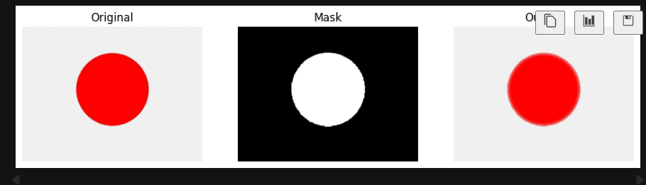

# Color Sensitive Blurring

## Description

This project applies blur to specific color regions in an image.
It detects a chosen color and blurs only those areas while keeping the rest of the image unchanged.

## Tools Used

* Python
* PyTorch
* NumPy

## How it Works

* Image is loaded
* Target color is detected using a mask
* Gaussian blur is applied
* Blur is combined with original image

## Output

The selected color region appears blurred while other parts remain clear.

